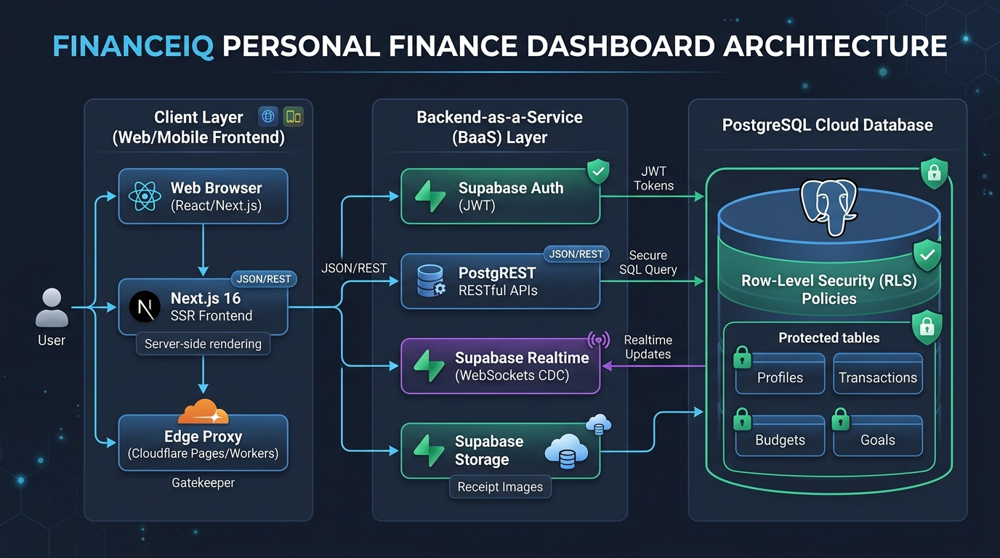
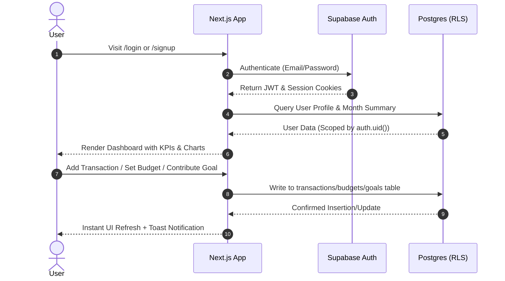

# FinanceIQ — Personal Finance Management Dashboard
## Project Report & Technical Documentation

---

## 1. Application Overview & Expected Objectives

**FinanceIQ** is a modern, full-stack, fintech-grade personal finance management SaaS platform. It is engineered to help individuals gain complete control over their financial health through data-driven tracking, automated analytics, budget tracking, goal setting, and intelligent financial insights.

### Key Objectives:
* **Centralized Financial Visibility:** Aggregate daily income and expenses across diverse categories and payment methods (UPI, Credit Card, Debit Card, Net Banking, Cash).
* **Proactive Budget Management:** Enable users to set monthly category budgets with real-time tracking, visual threshold warnings (safe, near limit, exceeded), and alerts.
* **Goal-Oriented Savings:** Facilitate targeted savings with circular progress tracking, estimated time-to-goal countdowns, and quick contribution capabilities.
* **Predictive & Comparative Insights:** Deliver real-time, rule-based financial insights that highlight spending spikes, savings rate health, and budget deviations without requiring external manual analysis.
* **Fintech-Grade User Experience:** Deliver an intuitive, responsive, and aesthetically engaging UI/UX with smooth micro-interactions, dark/light theme switching, and instant data reactivity.

---

## 2. Cloud Computing & Cloud Strategy Concepts Used

The architecture of FinanceIQ leverages contemporary cloud-native design paradigms:

* **Backend-as-a-Service (BaaS) & Serverless Architecture:**
  * Uses **Supabase Cloud** to eliminate monolithic server maintenance. Database provisioning, auto-scaling connection pooling (PgBouncer), API generation (PostgREST), and authentication are managed as managed cloud services.
* **Cloud Object Storage (Supabase Storage):**
  * Dedicated `receipts` cloud storage bucket for bill/invoice attachments (PNG, JPG, WebP, PDF) with fine-grained storage RLS policies ensuring users can only upload and view their own documents (`auth.uid() = folder[1]`).
* **Event-Driven Real-Time Replication (Supabase Realtime):**
  * PostgreSQL Change-Data-Capture (CDC) via Supabase Realtime WebSocket publications (`supabase_realtime`). Ledger modifications on any device immediately broadcast to all active client sessions.
* **Edge Proxy & Server-Side Rendering (SSR):**
  * Built on **Next.js App Router** with Edge/Proxy request interception (`proxy.ts`), ensuring session tokens and authentication cookies are refreshed at the network edge before reaching protected page routes.
* **Row-Level Security (RLS) & Zero-Trust Cloud Security:**
  * Database-level multi-tenancy isolation using PostgreSQL Row-Level Security (`auth.uid() = user_id`). Even if client queries are exposed, users cannot access or tamper with data belonging to other tenants.
* **Stateless Client & Managed State Persistence:**
  * Authentication sessions use cryptographically signed JWT cookies managed across SSR and browser environments via `@supabase/ssr`.
* **High-Availability & Cloud Database Indexing:**
  * Cloud Postgres database indexed by compound keys (`user_id, date DESC`, `user_id, month`) for optimized query latency and minimal cloud compute resource utilization.

---

## 3. Technology Stack Summary

| Layer | Technology / Tool Used |
|---|---|
| **Vibe Coding Tool / AI Assistant** | **Antigravity AI (Google DeepMind) / Agentic Coding Pair Programmer** |
| **Programming Language** | **TypeScript (Strict Mode), JavaScript (ESNext, Node.js)** |
| **Frontend Framework & UI** | **Next.js 16 (App Router, React 19, Turbopack)** |
| **Styling & Design System** | **Custom Vanilla CSS (CSS Custom Properties, Fluid Layouts, Zero-Tailwind)** |
| **Data Visualization** | **Chart.js & react-chartjs-2** (Line, Bar, Doughnut, Area charts) |
| **Icons & Micro-animations** | **Lucide React** (`lucide-react`) |
| **Backend & APIs** | **Next.js Server Components, Server Actions & Supabase REST API (PostgREST)** |
| **Database** | **PostgreSQL (Supabase Managed Cloud Postgres)** |
| **Cloud Object Storage** | **Supabase Storage (`receipts` bucket with RLS policies)** |
| **Real-time Engine** | **Supabase Realtime (WebSocket CDC postgres_changes)** |
| **Authentication** | **Supabase Auth (JWT-based GoTrue service with RLS integration)** |
| **Cloud Platform** | **Supabase Cloud Platform (AWS-backed Postgres, Storage, Realtime & Edge)** |

---

## 4. Architecture & Workflow

### 4.1 System Architecture Diagram


*Figure 1 — Cloud architecture: User → Frontend (Vercel) → Supabase Auth → Supabase Data API with RLS → Postgres + Storage → client-side Analytics rendered back into the Dashboard.*

```mermaid
graph TD
    User([End User / Client Browser]) -->|HTTPS / Next.js Client| NextApp[Next.js 16 Web Application]
    
    subgraph Frontend & SSR Layer
        NextApp -->|Route Middleware / Edge| Proxy[proxy.ts - Session Refresh]
        NextApp -->|Render Server Components| RSC[Protected Dashboard Routes]
        NextApp -->|Client Interactivity| ClientUI[Vanilla CSS / Chart.js Components]
    end

    subgraph Supabase Cloud Backend
        Proxy -->|Session Verification| Auth[Supabase Auth Service]
        RSC -->|SSR Parallel Fetching| PostgREST[Supabase PostgREST API]
        ClientUI -->|Browser CRUD Operations| PostgREST
        ClientUI -->|Direct Receipt Upload / Download| Storage[Supabase Cloud Storage (receipts)]
        ClientUI <-->|WebSocket CDC Live Sync| Realtime[Supabase Realtime Engine]
        
        subgraph PostgreSQL Database
            PostgREST -->|Enforce Policies| RLS[Row Level Security Engine]
            Storage -->|Storage RLS| RLS
            Realtime <-->|WAL Replication| RLS
            RLS --> T_Profiles[(profiles)]
            RLS --> T_Transactions[(transactions)]
            RLS --> T_Budgets[(budgets)]
            RLS --> T_Goals[(goals)]
        end
    end
```

### 4.2 Application Workflow



### 4.3 Main Features:
1. **Interactive Dashboard:** Real-time KPI summaries (Total Balance, Monthly Income, Monthly Expense, Savings Rate) with month-over-month trend percentages.
2. **Comprehensive Transaction Manager:** Filterable, searchable, and sortable ledger supporting inline editing, deletion, receipt attachments, and categorized tagging.
3. **Smart Budget Planner:** Dynamic category budget progress bars with automatic color transitions (Green for Safe, Amber for Warning at 75%, Red for Exceeded).
4. **Deep Financial Analytics:** 4 interactive charts analyzing income vs. expense curves, category spending breakdowns, and net savings accumulation over 6 months.
5. **Targeted Savings Goals:** Goal creation with custom milestone amounts, target dates, visual SVG circular rings, and quick contribution modals.
6. **🤖 AI & Statistical ML Spending Prediction:** Linear regression forecasting model projecting month-end totals, next-month demands, category breakdown estimations, and daily burn rates with statistical confidence scores.
7. **🔁 Intelligent Recurring & Subscription Detection:** Automated frequency clustering identifying regular commitments (e.g., Netflix, Spotify, Rent, Utilities) with next expected bill dates and annualized cost calculations.
8. **📂 Cloud Storage Receipt Attachment:** Direct client upload to Supabase Storage `receipts` bucket with storage-level RLS and in-app receipt image/PDF previewer.
9. **⚡ Real-Time Multi-Tab Synchronization:** Supabase Realtime CDC channels synchronizing transactions across devices without manual page reloads.
10. **Personalization & Settings:** Theme switching (Light/Dark mode), multi-currency support (₹ INR, $ USD, € EUR, £ GBP), and one-click CSV export.
11. **1-Click Realistic Seed Data Generator:** Populates 6 months of realistic transactions, budgets, and savings goals for instant demonstration.

---

## 5. Development Prompts Record

| S.No. | AI Tool | Prompt Used | Purpose |
|:---:|---|---|---|
| **1** | **Antigravity AI** | *"Build a modern, fintech-grade Personal Finance Management Dashboard with Next.js, Supabase, and custom Vanilla CSS with zero Tailwind. Include full auth, transactions, budgets, analytics, savings goals, and dark mode."* | Initial project scaffolding, requirement specification, and technical architecture generation. |
| **2** | **Antigravity AI** | *"Generate the PostgreSQL schema with profiles, transactions, budgets, and goals tables, complete with Row-Level Security (RLS) policies and indexes."* | Database design and secure multi-tenant data modeling. |
| **3** | **Antigravity AI** | *"Build the complete Vanilla CSS token design system in globals.css supporting dark mode variables, glassmorphism cards, responsive grids, and micro-animations."* | Creating the fintech visual design system and responsive foundations. |
| **4** | **Antigravity AI** | *"Create a realistic seed data generator (lib/seed.ts) to populate 6 months of historical transactions, category budgets, and savings goals for new users."* | Providing instant demonstration data for analytics and dashboard charts. |
| **5** | **Antigravity AI** | *"Implement the full protected dashboard suite: DashboardClient, TransactionsClient with multi-filter table, BudgetsClient, AnalyticsClient with Chart.js, GoalsClient with SVG rings, and InsightsClient."* | Core business logic, frontend visualization, and full CRUD component development. |
| **6** | **Antigravity AI** | *"Create a demo account for sign in and test it across all routes in the browser."* | End-to-end automated testing, Admin API account provisioning, and UI verification. |

---

## 6. Screenshots & Feature Walkthrough

### 6.1 Authentication (Login Page)

*Clean, centered fintech login card with email/password validation, show/hide password toggling, and fast session establishment.*

---

### 6.2 Overview Dashboard

*High-density financial cockpit displaying calculated balance (₹81,410), monthly income/expense changes, recent ledger rows, active goals, and quick actions.*

---

### 6.3 Transactions Ledger

*Full-featured transaction ledger with multi-criteria real-time filtering (search, type, category, month), column sorting, and inline edit/delete modals.*

---

### 6.4 Budget Management

*Category-wise monthly spending limits with automatic progress indicators, percentage computations, and status alerts (On Track, Near Limit, Over Budget).*

---

### 6.5 Financial Analytics & Visualizations

*Interactive Chart.js visualizations including 6-month Income vs. Expense area charts, monthly grouped bar charts, category spending doughnut, and net savings trajectories.*

---

### 6.6 Savings Goals Tracker

*Goal milestone tracking with customized SVG progress rings, target date countdowns, color/emoji customization, and quick deposit workflows.*

---

### 6.7 Financial Insights Engine

*Dynamic rule-based insights analyzing savings ratios, detecting high spending categories, and providing budget health checks.*

---

### 6.8 Settings & Personalization

*Profile management, global currency selection, theme toggle, full CSV transaction data export, and nuclear data wipe options.*

---

### 6.9 Dark Mode Theme

*High-contrast, eye-friendly dark mode with glowing border accents and tokenized HSL color palettes.*

---

## 7. Challenges Encountered & Solutions

| Category | Problem Encountered | Root Cause | Solution Implemented |
|---|---|---|---|
| **Next.js 16 Deprecation** | `middleware.ts` deprecation warning during production build (`TS / Turbopack`). | Next.js 16 introduced the `proxy.ts` convention for edge request handling. | Migrated session handler to `proxy.ts` using Next.js codemod & custom configuration. |
| **TypeScript Type Checks** | Build failure in `components/ui/Skeleton.tsx` (`style` prop not declared in interface). | `SkeletonProps` omitted standard `React.CSSProperties` type definition. | Updated interface to explicitly accept `style?: React.CSSProperties` and forwarded props. |
| **Route Collision** | Default Next.js starter page (`app/page.tsx`) conflicted with `app/(dashboard)/page.tsx`. | Both files claimed the root `/` path in Next.js App Router hierarchy. | Cleanly removed scaffolded boilerplate files, allowing route grouping to cleanly handle `/`. |
| **Supabase Rate Limits** | `Email rate limit exceeded` on signup during rapid browser automation testing. | Default Supabase free-tier SMTP enforces hourly rate limits on confirmation emails. | Developed an automated Node.js admin provisioning script (`create-demo-user.mjs`) using Supabase Service Secret Key to instantly generate confirmed users. |
| **Multi-Tenancy Security** | Risk of accidental data leakage between multiple authenticated users. | Global queries without user filtering could expose transactions across accounts. | Enforced database-level PostgreSQL Row Level Security (RLS) on all 4 tables with strict `auth.uid() = user_id` policies. |

---

## 8. Experience with Vibe Coding & AI-Assisted Development

Developing **FinanceIQ** using Antigravity AI's Vibe Coding workflow demonstrated how modern software engineering has transformed:

* **Velocity & Flow State:** Full-stack development — from architecture planning, SQL schema drafting, component design system creation, to automated test execution — was completed seamlessly without context switching.
* **Declarative Prompt-to-Implementation:** High-level architectural intent ("*Modern fintech look, vanilla CSS, strict types, RLS security*") was accurately converted into modular, maintainable TypeScript files.
* **Autonomous Error Recovery:** When compilation errors (TypeScript type mismatch) or framework deprecations (Next.js 16 proxy) occurred, the AI diagnosed logs, executed surgical code edits, and re-verified builds automatically.
* **Visual & Real-Time Verification:** Through browser subagents, the AI actively interacted with the UI, captured screenshots, submitted forms, and proved correctness visually.

---

## 9. Key Learnings & Takeaways

### 1. Cloud Concepts
* **BaaS vs. Traditional Backends:** Offloading auth, database pooling, and API generation to Supabase drastically reduces boilerplate while maintaining enterprise-grade PostgreSQL power.
* **Zero-Trust Security via RLS:** Security is most resilient when enforced directly at the database tier through Row-Level Security rather than solely relying on application API middleware.

### 2. Application Development
* **Modern App Router Architecture:** Effective separation between Server Components (for parallel data fetching) and Client Components (for UI state and charts) yields instant page loads and minimal client bundle sizes.
* **Vanilla CSS Design Systems:** Building a clean CSS Custom Property design system provides complete styling control, prevents CSS bloat, and makes theme switching trivial without heavy third-party CSS dependencies.

### 3. AI-Assisted Coding & Prompt Engineering
* **Structured & Context-Rich Prompts:** Specifying explicit constraints (e.g., exact tech stack, color palettes, accessibility attributes, error states) produces production-ready code on the first attempt.
* **Iterative Verification:** Combining code generation with automated build runs (`next build`) and browser subagent tests guarantees robust software delivery.

### 4. Debugging & Testing
* **End-to-End Visual Testing:** Automated browser interaction is essential for detecting nuanced issues (like route collisions or modal scroll-locks) that unit tests often overlook.
* **Resilient API Handling:** Having admin-level backend scripts ready is a great safety net when dealing with external cloud service rate limits.
