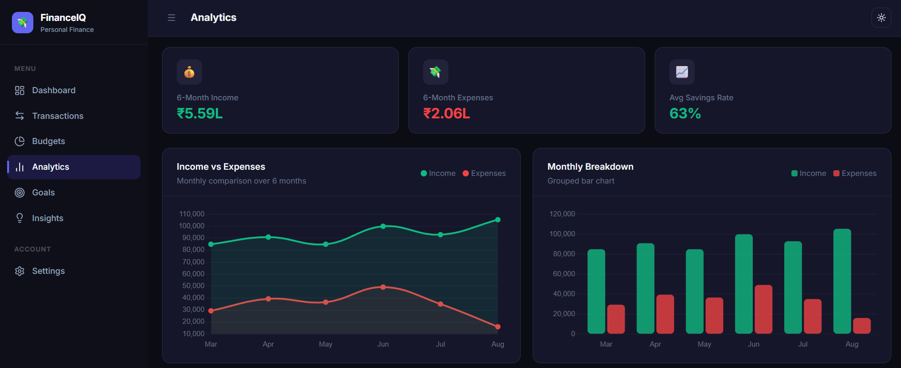

# FinanceIQ — Personal Finance Management Dashboard

A modern, full-stack personal finance dashboard built with **Next.js 16**, **Supabase**, and **Vanilla CSS**.



## ✨ Features

- 📊 **Real-time Dashboard** — KPI cards, monthly summaries, spending trends
- 💸 **Transaction Manager** — Add, edit, delete with categories, search, filter & sort
- 📋 **Budget Planner** — Set monthly limits per category with visual progress tracking
- 📈 **Analytics** — 4 interactive Chart.js charts (line, bar, doughnut, savings trend)
- 🎯 **Savings Goals** — Circular progress rings with contribution tracking
- 💡 **Financial Insights** — Automated, data-driven spending intelligence
- ⚙️ **Settings** — Profile, multi-currency, dark/light mode, CSV export
- 🔐 **Secure Auth** — Supabase Auth with Row-Level Security (RLS) on all data

---

## 🚀 Getting Started

### 1. Clone and Install

```bash
git clone <repo-url>
cd financeiq
npm install
```

### 2. Configure Environment

Create `.env.local`:

```env
NEXT_PUBLIC_SUPABASE_URL=your_supabase_project_url
NEXT_PUBLIC_SUPABASE_ANON_KEY=your_supabase_anon_key
SUPABASE_SERVICE_ROLE_KEY=your_supabase_service_role_key
```

### 3. Set Up Database

Run [`supabase-setup.sql`](./supabase-setup.sql) in your Supabase SQL Editor.

This creates:
- `profiles`, `transactions`, `budgets`, `goals` tables
- Row Level Security (RLS) policies for multi-tenant data isolation
- Indexes for optimized query performance
- Auto-profile trigger on user signup

### 4. Run Development Server

```bash
npm run dev
```

Open [http://localhost:3000](http://localhost:3000)

---

## 🧪 Running Tests

```bash
npm test
```

Tests cover utility functions, financial calculations, data validation, and business logic.

---

## 🏗️ Tech Stack

| Layer | Technology |
|---|---|
| Framework | Next.js 16 (App Router, Server Components) |
| Language | TypeScript (strict mode) |
| Styling | Vanilla CSS with CSS Custom Properties |
| Database | PostgreSQL (Supabase) |
| Auth | Supabase Auth (JWT + RLS) |
| Charts | Chart.js + react-chartjs-2 |
| Icons | Lucide React |

---

## 📁 Project Structure

```
app/
├── (auth)/          # Login & Signup pages
├── (dashboard)/     # Protected dashboard routes
│   ├── page.tsx         # Dashboard overview
│   ├── transactions/    # Transaction CRUD
│   ├── budgets/         # Budget management
│   ├── analytics/       # Charts & trends
│   ├── goals/           # Savings goals
│   ├── insights/        # Financial insights
│   └── settings/        # User preferences
components/
├── layout/          # Sidebar, TopBar, MobileNav
├── transactions/    # Transaction form
└── ui/              # Modal, Toast, Progress, Skeleton
lib/
├── supabase/        # Client, Server, Middleware
├── constants.ts     # Categories, currencies
├── utils.ts         # Formatting utilities
└── seed.ts          # Sample data generator
```

---

## 🔒 Security

- All data is protected with PostgreSQL Row-Level Security
- Users can only access their own data (`auth.uid() = user_id`)
- Service role key is never exposed to the client
- JWT sessions are securely managed via `@supabase/ssr`

---

## 📄 Documentation

Full project report: [`PROJECT_REPORT.md`](./PROJECT_REPORT.md)

---

## 🌐 Deployment

Deploy on [Vercel](https://vercel.com) — set the three environment variables and deploy.

```bash
npm run build   # Verify production build
```
